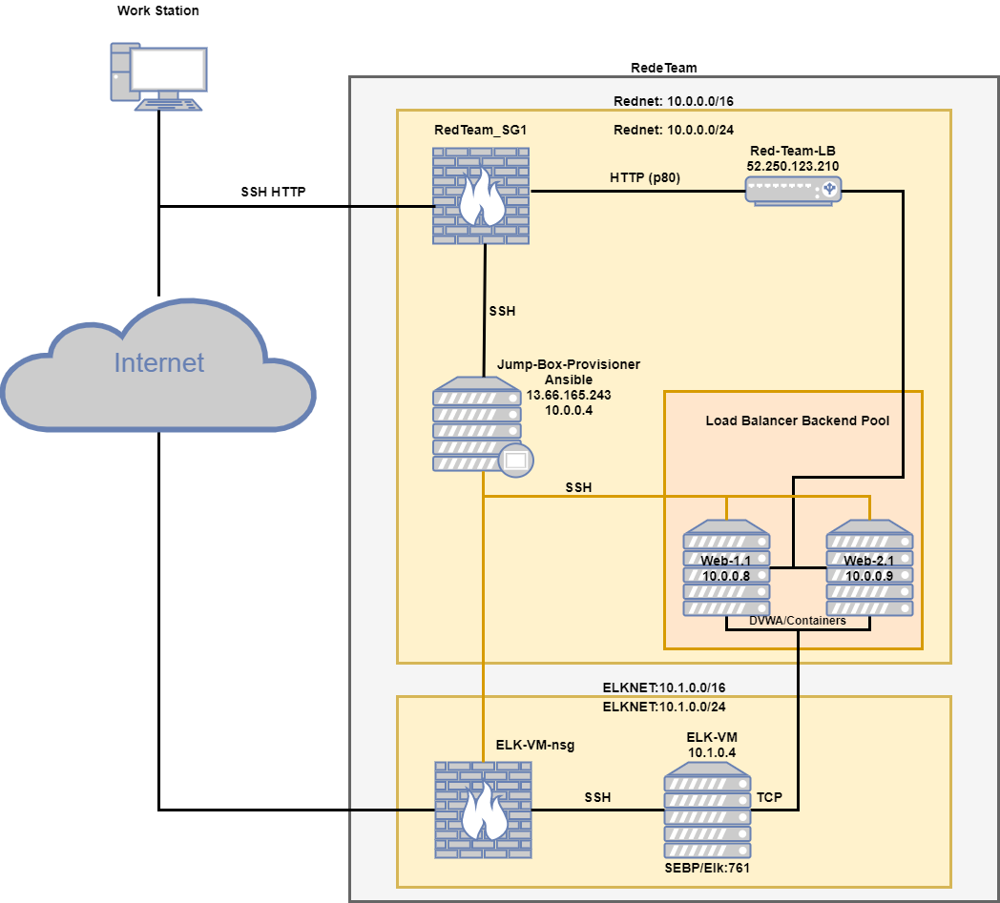
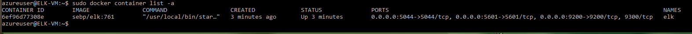

## Automated ELK Stack Deployment

The files in this repository were used to configure the network depicted below.

These files have been tested and used to generate a live ELK deployment on Azure. They can be used to either recreate the entire deployment pictured above. Alternatively, select portions of the install-elk.yml file may be used to install only certain pieces of it, such as Filebeat or Metricbeat.

  - [ELK Install File](ELK/YAMLFiles/install-elk.yml) 
  - [Filebeat Install](ELK/YAMLFiles/filebeat-playbook.yml) 
  - [Metricbeat Install](ELK/YAMLFiles/metricbeat-playbook.yml)

This document contains the following details:
- Description of the Topologu
- Access Policies
- ELK Configuration
  - Beats in Use
  - Machines Being Monitored
- How to Use the Ansible Build

### Description of the Topology

The main purpose of this network is to expose a load-balanced and monitored instance of DVWA, the D*mn Vulnerable Web Application.

Load balancing ensures that the application will be highly available, in addition to restricting traffic to the network.
- Load balancers ensures availability and reliability of the servers. 

What is the advantage of a jump box? 
- A jump box is a secure computer that all admins first connect to before launching any administrative task or use as an origination point to connect to other servers or untrusted environments

Integrating an ELK server allows users to easily monitor the vulnerable VMs for changes to the logs and system traffic.
- What does Filebeat watch for? Filebeat watches for log files/locations and collects log events.
- What does Metricbeat record? Metricbeat records metric and statistical data from the opertaing system and from services running on the server.

The configuration details of each machine may be found below:

| Name                 | Function | IP Address | Operating System |
|----------------------|----------|------------|------------------|
| Jump-Box-Provisioner | Gateway  | 10.0.0.4   | Linux (ubuntu)   |
| Web-1.1              | Server   | 10.0.0.8   | Linux (ubuntu)   |
| Web-2.1              | Server   | 10.0.0.9   | Linux (ubuntu)   |
| ELK-VM               | Server   | 10.1.0.4   | Linux (ubuntu)   |

### Access Policies

The machines on the internal network are not exposed to the public Internet. 

Only the Jump-Box-Provisioner machine and the ELK-VM can accept connections from the Internet. Access to this machine is only allowed from the following IP addresses:
- Personal IP Address
- Jumpbox to ELK-VM via 10.0.0.4

Machines within the network can only be accessed by SSH.
- The Elk-VM (10.1.0.4) differs because it can be accessed via the Jumpbox (10.0.0.4) or the Personal IP.

A summary of the access policies in place can be found in the table below.

| Name                 | Publicly Accessible | Allowed IP Addresses   |
|----------------------|---------------------|------------------------|
| Jump-Box-Provisioner | No                  | Personal IP            |
| Web-1.1              | No                  | 10.0.0.4               |
| Web-2.1              | No                  | 10.0.0.4               |
| ELK-VM               | No                  | 10.0.0.4 & Personal IP |

### Elk Configuration

Ansible was used to automate configuration of the ELK machine. No configuration was performed manually, which is advantageous because:
- Ease of use with minimal learning curve.
- Allows for Playbooks to configure multiple machines through a single command.

The playbook implements the following tasks:
- Create a new VM and keep note of the Private and Public IP.
  - The Private IP will be used for SSHing into the box and the Public IP will used to monitor metrics via Kibana Portal
- Download and configure the 'elk-docker' container.
  - Update the hosts.conf to add your new VM server and Private IP.
  - Then create a new Playbook to download, install, configure your new server with ports 5601,9200, and 5044 (Reference: [ELK Install File](ELK/YAMLFiles/install-elk.yml)).
- Launch and attach the container.
- SSH into the 'elk-docker' container via your Jumpbox and run the command 'sudo docker ps'
- Configure your Inbound security rules to allow ports: 5601 and 9200
- You should now be able to access [Kibana Portal](ELK/Ansible/KibanaWORKS.PNG) via the 'Public IP:5601'

The following screenshot displays the result of running `docker ps` after successfully configuring the ELK instance.

### Target Machines & Beats
This ELK server is configured to monitor the following machines:
- 10.0.0.8 and 10.0.0.9

We have installed the following Beats on these machines:
- [Filebeat](ELK/Ansible/Filebeat.PNG)
- [Metricbeat](ELK/Ansible/Metricbeat.PNG)

These Beats allow us to collect the following information from each machine:
- Filebeat is a lightweight shipper for forwarding and centralizing log data. Filebeat monitors log files or locations you specify, collects log events, and forwards them either to Elasticsearch or Logstash for indexing.
- Metricbeat collects metrics from the operating system and from services running on the server. Metricbeat then takes the metrics and statistics that it collects and ships them to the output that you specify.

### Using the Playbook
In order to use the playbook, you will need to have an Ansible control node already configured. Assuming you have such a control node provisioned: 

SSH into the control node and follow the steps below:
- Copy the configuration files of Filebeat and Metrobeat to the /etc/ansible/roles/files directory. You can use the commands:
  - `curl https://gist.githubusercontent.com/slape/5cc350109583af6cbe577bbcc0710c93/raw/eca603b72586fbe148c11f9c87bf96a63cb25760/Filebeat > /etc/ansible/files/filebeat-config.yml`
  - `curl https://gist.githubusercontent.com/slape/58541585cc1886d2e26cd8be557ce04c/raw/0ce2c7e744c54513616966affb5e9d96f5e12f73/metricbeat > /etc/ansible/files/metricbeat-config.yml`
- Update the seperate Beats configuration files to set the proper hosts and username of your elk machine (IP:PORT) under 'output.elasticsearch' and 'setup.kibana'
- Run the [Filebeat Playbook](ELK/YAMLFiles/filebeat-playbook.yml) and [Metricbeat Playbook](ELK/YAMLFiles/metricbeat-playbook.yml), and navigate to the 'Elk docker' container to check that the installation worked as expected with the command 'docker ps'.

Which file is the playbook? Where do you copy it?
 - The two actual Playbooks are the provided [Filebeat.yml](ELK/YAMLFiles/filebeat-playbook.yml) and [Metricbeat.yml](ELK/YAMLFiles/metricbeat-playbook.yml) files, and I reccomend to copy them to /etc/ansible/roles
Which URL do you navigate to in order to check that the ELK server is running?
  - You navigate to the Kibana Portal to ensure that the ELK server is running (ELK Public IP:5601)

Example commands to run and configure the 'Elk container':
- `ssh user@Jumpbox(Private IP)`
- `sudo docker container list -a (locates available containers)`
- `sudo docker start (name of container)`
- `sudo docker attach (name of container)`
- `curl https://gist.githubusercontent.com/slape/5cc350109583af6cbe577bbcc0710c93/raw/eca603b72586fbe148c11f9c87bf96a63cb25760/Filebeat > /etc/ansible/files/filebeat-config.yml`
- `curl https://gist.githubusercontent.com/slape/58541585cc1886d2e26cd8be557ce04c/raw/0ce2c7e744c54513616966affb5e9d96f5e12f73/metricbeat > /etc/ansible/files/metricbeat-config.yml`
- `cd /etc/ansible/roles/`
- `cp /Downloads/filebeat-playbook.yml /etc/ansible/roles/ | cp /Downloads/metricbeat-playbook.yml /etc/ansible/roles/`
- `ansible-playbook filebeat-playbook.yml && ansible-playbook metricbeat-playbook.yml`
- `ssh user@Elk(Private IP)`
- `docker ps`
- `Open browser and navigate to (ELK Public IP):5601`
  - if on linux: `firefox --new-window (Elk Public IP):5601`

This should open up your Kibana dashboard if all Security Inbound settings and steps have been run properly.
